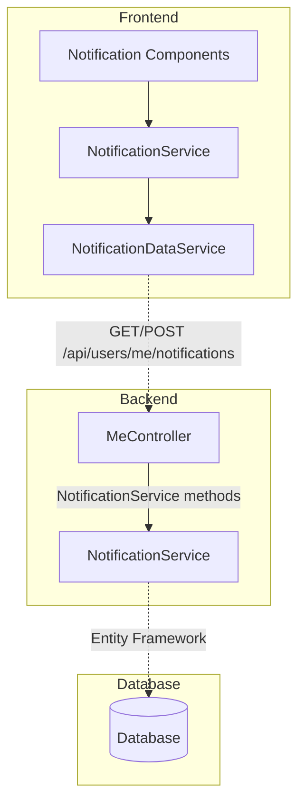

# {{ page.title }}

LightNap includes an in-app notification system that allows the application to deliver real-time notifications to logged-in users. These notifications appear in the user's notification panel and provide a way to keep users informed about important events, updates, and activities within the application. This article explains how to add a new type of notification to the application, following the established patterns used throughout the system.

- TOC
{:toc}

## Understanding the Notification System

The in-app notification system in LightNap provides persistent, user-specific messages that are stored in the database and displayed in the UI. Unlike transient toast messages, these notifications remain available until the user reads or dismisses them.

The system follows the standard LightNap architecture pattern:

- **Backend**: Notifications are stored as entities in the database and managed through a `NotificationService` in `LightNap.Core`.
- **API Layer**: The `MeController` exposes endpoints under `/api/users/me/notifications` for managing notifications.
- **Frontend**: An Angular service (`NotificationService`) and components handle displaying and managing notifications in the UI.

By default, LightNap includes core notification infrastructure. Adding a new notification type involves creating the trigger logic in your application services and ensuring the notification data includes the appropriate type identifier.

## Understanding the Notification Entity

The notification system is built on a `Notification` entity stored in the database. Each notification typically contains:

- **Id**: Unique identifier for the notification
- **UserId**: The ID of the user who should receive the notification
- **Type**: A string identifier for the notification type (e.g., "WelcomeMessage", "NewComment", "SystemAlert")
- **Title**: A short, descriptive title
- **Message**: The detailed notification message
- **IsRead**: Boolean indicating whether the user has read the notification
- **CreatedAt**: Timestamp when the notification was created
- **Link**: Optional URL or route to navigate to when the notification is clicked

## Backend Implementation

### Step 1: Understand the Notification Service

The `INotificationService` in `LightNap.Core/Notifications/Interfaces` provides methods for creating and managing notifications. The typical interface includes:

```csharp
public interface INotificationService
{
    Task<NotificationDto> CreateNotificationAsync(CreateNotificationDto dto);
    Task<PagedResponse<NotificationDto>> GetUserNotificationsAsync(
        string userId,
        SearchNotificationsDto searchDto);
    Task MarkAsReadAsync(string notificationId, string userId);
    Task DeleteNotificationAsync(string notificationId, string userId);
    Task<int> GetUnreadCountAsync(string userId);
}
```

### Step 2: Create a Notification in Your Service

To add a new notification type, inject `INotificationService` into your application service and call it when the triggering event occurs. For example, let's create a "Welcome" notification when a user completes registration:

1. Open the service where you want to trigger the notification (e.g., `IdentityService.cs` in `LightNap.Core/Identity/Services`).

2. Inject `INotificationService` into the constructor:

    ```csharp
    public class IdentityService : IIdentityService
    {
        private readonly INotificationService _notificationService;
        private readonly UserManager<ApplicationUser> _userManager;
        // ... other dependencies

        public IdentityService(
            INotificationService notificationService,
            UserManager<ApplicationUser> userManager,
            // ... other dependencies
        )
        {
            this._notificationService = notificationService;
            this._userManager = userManager;
            // ... initialize other dependencies
        }
    }
    ```

3. Create the notification after the triggering event:

    ```csharp
    public async Task<ApiResponseDto<LoginResponseDto>> RegisterAsync(RegisterRequestDto dto)
    {
        // Existing registration logic...

        var result = await this._userManager.CreateAsync(user, dto.Password);

        if (result.Succeeded)
        {
            // Existing post-registration logic...

            // Create welcome notification
            await this._notificationService.CreateNotificationAsync(new CreateNotificationDto
            {
                UserId = user.Id,
                Type = "WelcomeMessage",
                Title = "Welcome to LightNap!",
                Message = $"Hi {user.UserName}, welcome to our application! We're excited to have you on board.",
                Link = "/profile" // Optional: link to profile page
            });

            // Continue with remaining logic...
        }

        // Return response...
    }
    ```

### Step 3: Define Notification Type Constants

To maintain consistency and avoid typos, create constants for your notification types:

1. Create or update a constants file in `LightNap.Core/Configuration/Constants.cs`:

    ```csharp
    public static class NotificationTypes
    {
        public const string WelcomeMessage = "WelcomeMessage";
        public const string NewComment = "NewComment";
        public const string SystemAlert = "SystemAlert";
        public const string ProfileUpdated = "ProfileUpdated";
        public const string RoleChanged = "RoleChanged";
        // Add more notification types as needed
    }
    ```

2. Use the constants in your code:

    ```csharp
    await this._notificationService.CreateNotificationAsync(new CreateNotificationDto
    {
        UserId = user.Id,
        Type = NotificationTypes.WelcomeMessage,
        Title = "Welcome to LightNap!",
        Message = $"Hi {user.UserName}, welcome to our application!",
        Link = "/profile"
    });
    ```

## Targeting Notifications by Role or Claim

Instead of sending notifications to a specific user, you can target groups of users based on their roles or claims. The `INotificationService` provides methods to send notifications to all users in a role or with a specific claim:

```csharp
// Notify all users in a role
await this._notificationService.CreateSystemNotificationForRoleAsync(
    "Administrator",
    new CreateNotificationRequestDto
    {
        Type = NotificationTypes.AdminAnnouncement,
        Data = new Dictionary<string, object>
        {
            { "title", "System Maintenance" },
            { "message", "Scheduled maintenance tonight at 10 PM." }
        }
    });

// Notify all users with a specific claim
await this._notificationService.CreateSystemNotificationForClaimAsync(
    new ClaimDto { Type = "Feature", Value = "BetaAccess" },
    new CreateNotificationRequestDto
    {
        Type = NotificationTypes.FeatureUpdate,
        Data = new Dictionary<string, object>
        {
            { "title", "New Beta Feature Available" },
            { "message", "Check out the new feature we just released!" }
        }
    });
```

For more information on working with roles and claims, see [Working with Roles](working-with-roles.md) and [Custom Claims](custom-claims.md)

## Frontend Implementation

The frontend notification system follows LightNap's standard data flow pattern: DTOs → Data Services → Application Services → Components.

### Understanding the Frontend Architecture

The notification functionality on the frontend is organized as follows:

- **DTOs**: Located in `app/core/backend-api/notifications/dtos`, these TypeScript interfaces map to backend DTOs
- **Data Service**: Located in `app/core/backend-api/notifications/services`, handles HTTP requests to `/api/users/me/notifications`
- **Application Service**: Located in `app/core/notifications/services`, provides a higher-level API and manages notification state
- **Components**: Various UI components that display and interact with notifications

### Step 1: Understand the Frontend DTOs

The frontend DTOs mirror the backend DTOs and are typically located in `app/core/backend-api/notifications/dtos`. The notification interface includes properties for the notification's id, type, title, message, optional link, read status, and creation timestamp.

### Step 2: Using the Notification Service

The `NotificationService` is typically available as a singleton service. To display notifications in your component:

```typescript
import { Component, OnInit } from '@angular/core';
import { NotificationService } from '@core/notifications/services/notification.service';
import { Observable } from 'rxjs';

@Component({
  selector: 'app-my-component',
  templateUrl: './my-component.component.html'
})
export class MyComponent implements OnInit {
  unreadCount$!: Observable<number>;

  constructor(private notificationService: NotificationService) {}

  ngOnInit(): void {
    // Watch for unread notification count
    this.unreadCount$ = this.notificationService.watchUnreadCount$();

    // Refresh notifications when component loads
    this.notificationService.refreshNotifications();
  }
}
```

### Step 3: Displaying Notifications in the UI

Notifications are typically displayed in a bell icon menu in the application header. The notification service exposes observables that components can subscribe to:

```typescript
// In your header or notification panel component
import { Component, OnInit } from '@angular/core';
import { NotificationService } from '@core/notifications/services/notification.service';
import { Notification } from '@core/backend-api/notifications/dtos/response/notification';
import { Observable } from 'rxjs';

@Component({
  selector: 'app-notification-panel',
  template: `
    <div class="notification-panel">
      <div class="notification-header">
        <h3>Notifications</h3>
        <span class="badge" *ngIf="(unreadCount$ | async) as count">{{ count }}</span>
      </div>

      <div class="notification-list">
        <div
          *ngFor="let notification of (notifications$ | async)"
          class="notification-item"
          [class.unread]="!notification.isRead"
          (click)="markAsRead(notification)">

          <div class="notification-icon" [attr.data-type]="notification.type">
            <i [class]="getNotificationIcon(notification.type)"></i>
          </div>

          <div class="notification-content">
            <h4>{{ notification.title }}</h4>
            <p>{{ notification.message }}</p>
            <span class="notification-time">{{ notification.createdAt | date: 'short' }}</span>
          </div>
        </div>
      </div>
    </div>
  `
})
export class NotificationPanelComponent implements OnInit {
  notifications$!: Observable<Notification[]>;
  unreadCount$!: Observable<number>;

  constructor(private notificationService: NotificationService) {}

  ngOnInit(): void {
    this.notifications$ = this.notificationService.watchNotifications$();
    this.unreadCount$ = this.notificationService.watchUnreadCount$();
  }

  markAsRead(notification: Notification): void {
    if (!notification.isRead) {
      this.notificationService.markAsRead(notification.id).subscribe();
    }

    // Navigate to link if provided
    if (notification.link) {
      // Use your routing service to navigate
      this.router.navigate([notification.link]);
    }
  }

  getNotificationIcon(type: string): string {
    const iconMap: { [key: string]: string } = {
      'WelcomeMessage': 'pi pi-user',
      'NewComment': 'pi pi-comment',
      'SystemAlert': 'pi pi-exclamation-triangle',
      'ProfileUpdated': 'pi pi-user-edit',
      'RoleChanged': 'pi pi-shield'
    };
    return iconMap[type] || 'pi pi-bell';
  }
}
```

### Step 4: Customizing Notification Display by Type

You can customize how different notification types appear in your UI:

```typescript
// Create a helper service for notification presentation
@Injectable({
  providedIn: 'root'
})
export class NotificationPresentationService {
  getNotificationStyle(type: string): { icon: string; color: string; severity: string } {
    const styles: { [key: string]: { icon: string; color: string; severity: string } } = {
      'WelcomeMessage': {
        icon: 'pi pi-user',
        color: '#4CAF50',
        severity: 'success'
      },
      'NewComment': {
        icon: 'pi pi-comment',
        color: '#2196F3',
        severity: 'info'
      },
      'SystemAlert': {
        icon: 'pi pi-exclamation-triangle',
        color: '#FF9800',
        severity: 'warn'
      },
      'ProfileUpdated': {
        icon: 'pi pi-user-edit',
        color: '#9C27B0',
        severity: 'info'
      },
      'RoleChanged': {
        icon: 'pi pi-shield',
        color: '#F44336',
        severity: 'warn'
      }
    };

    return styles[type] || {
      icon: 'pi pi-bell',
      color: '#607D8B',
      severity: 'info'
    };
  }
}
```

## Real-Time Notifications (Optional)

For a more responsive user experience, consider implementing real-time notification delivery using SignalR:

1. **Backend Setup**: Add SignalR hub for notification broadcasting
2. **Frontend Integration**: Connect to the SignalR hub and listen for new notifications
3. **Update UI**: Automatically display new notifications without page refresh

```typescript
// Example of SignalR integration in NotificationService
import { HubConnection, HubConnectionBuilder } from '@microsoft/signalr';

@Injectable({
  providedIn: 'root'
})
export class NotificationService {
  private hubConnection?: HubConnection;

  constructor(private notificationDataService: NotificationDataService) {
    this.initializeSignalR();
  }

  private initializeSignalR(): void {
    this.hubConnection = new HubConnectionBuilder()
      .withUrl('/notificationHub')
      .build();

    this.hubConnection.on('ReceiveNotification', (notification: Notification) => {
      // Add notification to the local observable stream
      this.addNotification(notification);
    });

    this.hubConnection.start();
  }
}
```

## Testing Your Notification

### 1. Backend Testing

Create unit tests for your notification creation logic:

```csharp
[TestMethod]
public async Task CreateWelcomeNotification_ShouldSucceed()
{
    // Arrange
    var userId = "test-user-id";
    var notificationDto = new CreateNotificationDto
    {
        UserId = userId,
        Type = NotificationTypes.WelcomeMessage,
        Title = "Welcome!",
        Message = "Welcome to the application",
        Link = "/profile"
    };

    // Act
    var result = await _notificationService.CreateNotificationAsync(notificationDto);

    // Assert
    Assert.IsNotNull(result);
    Assert.AreEqual(NotificationTypes.WelcomeMessage, result.Type);
    Assert.AreEqual(userId, result.UserId);
}
```

### 2. Integration Testing

Test the complete flow from trigger to notification creation:

```csharp
[TestMethod]
public async Task UserRegistration_ShouldCreateWelcomeNotification()
{
    // Arrange
    var registerDto = new RegisterRequestDto
    {
        UserName = "testuser",
        Email = "test@example.com",
        Password = "TestPassword123!"
    };

    // Act
    var result = await _identityService.RegisterAsync(registerDto);

    // Assert
    var notifications = await _notificationService.GetUserNotificationsAsync(
        result.Result.UserId,
        new SearchNotificationsDto { PageSize = 10 }
    );

    Assert.IsTrue(notifications.Items.Any(n => n.Type == NotificationTypes.WelcomeMessage));
}
```

### 3. Frontend Testing

Test the notification service and components:

```typescript
describe('NotificationService', () => {
  let service: NotificationService;
  let httpMock: HttpTestingController;

  beforeEach(() => {
    TestBed.configureTestingModule({
      imports: [HttpClientTestingModule],
      providers: [NotificationService]
    });

    service = TestBed.inject(NotificationService);
    httpMock = TestBed.inject(HttpTestingController);
  });

  it('should fetch notifications', () => {
    const mockNotifications: Notification[] = [
      {
        id: '1',
        userId: 'user1',
        type: 'WelcomeMessage',
        title: 'Welcome',
        message: 'Welcome to the app',
        isRead: false,
        createdAt: new Date()
      }
    ];

    service.getNotifications().subscribe(notifications => {
      expect(notifications.length).toBe(1);
      expect(notifications[0].type).toBe('WelcomeMessage');
    });

    const req = httpMock.expectOne('/api/users/me/notifications');
    req.flush({ result: mockNotifications });
  });
});
```

### 4. End-to-End Testing

Test the complete user experience:

1. Register a new user account
2. Verify the welcome notification appears in the notification panel
3. Click the notification to mark it as read
4. Verify the unread count decreases
5. Navigate to the linked page if applicable

## Best Practices

### 1. Use Type Constants

Always use constants for notification types to maintain consistency and avoid typos:

```csharp
// Good
await _notificationService.CreateNotificationAsync(new CreateNotificationDto
{
    Type = NotificationTypes.WelcomeMessage,
    // ...
});

// Bad - prone to typos
await _notificationService.CreateNotificationAsync(new CreateNotificationDto
{
    Type = "WelcomeMessage",
    // ...
});
```

### 2. Implement Error Handling

Notification creation should not break the main application flow. Wrap notification calls in try-catch blocks:

```csharp
public async Task<ApiResponseDto<LoginResponseDto>> RegisterAsync(RegisterRequestDto dto)
{
    // Main registration logic...

    try
    {
        await this._notificationService.CreateNotificationAsync(new CreateNotificationDto
        {
            UserId = user.Id,
            Type = NotificationTypes.WelcomeMessage,
            Title = "Welcome to LightNap!",
            Message = $"Hi {user.UserName}, welcome to our application!",
            Link = "/profile"
        });
    }
    catch (Exception ex)
    {
        // Log the error but don't fail the registration
        this._logger.LogError(ex, "Failed to create welcome notification for user {UserId}", user.Id);
    }

    // Continue with response...
}
```

### 3. Keep Messages Concise

Notification messages should be brief and actionable:

```csharp
// Good - Clear and concise
Title = "New Comment"
Message = "John Doe replied to your post."
Link = "/posts/123/comments"

// Bad - Too verbose
Title = "You have received a new comment notification"
Message = "Hi there! We wanted to let you know that another user has taken the time to write a thoughtful response to one of your recent posts on the platform..."
```

### 4. Implement Notification Expiration

Consider adding expiration logic to automatically clean up old notifications:

```csharp
// In your maintenance service or background job
public async Task CleanupExpiredNotificationsAsync()
{
    var cutoffDate = DateTime.UtcNow.AddDays(-30);
    var expiredNotifications = await _dbContext.Notifications
        .Where(n => n.CreatedAt < cutoffDate && n.IsRead)
        .ToListAsync();

    _dbContext.Notifications.RemoveRange(expiredNotifications);
    await _dbContext.SaveChangesAsync();
}
```

### 5. Provide Clear Navigation

When including links in notifications, ensure they navigate to relevant content:

```csharp
// Good - Specific and relevant
await _notificationService.CreateNotificationAsync(new CreateNotificationDto
{
    Type = NotificationTypes.NewComment,
    Title = "New Comment",
    Message = $"{commenterName} replied to your post.",
    Link = $"/posts/{postId}/comments/{commentId}" // Direct link to the comment
});

// Less ideal - Generic link
Link = "/posts" // User has to find the post themselves
```

### 6. Batch Notifications Wisely

For high-frequency events, consider batching notifications to avoid overwhelming users:

```csharp
// Instead of creating a notification for each like
// Create a single notification with aggregated information
if (newLikeCount >= 10)
{
    await _notificationService.CreateNotificationAsync(new CreateNotificationDto
    {
        Type = NotificationTypes.PostEngagement,
        Title = "Your post is popular!",
        Message = $"Your post has received {newLikeCount} likes.",
        Link = $"/posts/{postId}"
    });
}
```

### 7. Localization Support

For multi-language applications, consider storing notification templates with localization support:

```csharp
public async Task CreateLocalizedNotificationAsync(
    string userId,
    string type,
    string languageCode,
    Dictionary<string, string> parameters)
{
    var title = _localizer[$"Notification.{type}.Title", languageCode];
    var message = string.Format(
        _localizer[$"Notification.{type}.Message", languageCode],
        parameters["userName"]);

    await _notificationService.CreateNotificationAsync(new CreateNotificationDto
    {
        UserId = userId,
        Type = type,
        Title = title,
        Message = message
    });
}
```

### 8. User Preferences

Allow users to control which notifications they receive:

```csharp
public async Task<bool> ShouldCreateNotificationAsync(
    string userId,
    string notificationType)
{
    var userPreferences = await _dbContext.NotificationPreferences
        .FirstOrDefaultAsync(p => p.UserId == userId);

    if (userPreferences == null)
    {
        return true; // Default to sending all notifications
    }

    return userPreferences.EnabledTypes.Contains(notificationType);
}

// Use before creating notification
if (await ShouldCreateNotificationAsync(userId, NotificationTypes.NewComment))
{
    await _notificationService.CreateNotificationAsync(/* ... */);
}
```

## Common Notification Types

Here are some common notification types you might want to implement in your application:

### Account & Security

- **WelcomeMessage**: Sent when a user first registers
- **PasswordChanged**: Alert when password is updated
- **EmailChanged**: Confirmation of email address change
- **NewDeviceLogin**: Alert for login from unrecognized device
- **TwoFactorEnabled**: Confirmation of 2FA activation

### User Engagement

- **ProfileViewed**: Someone viewed your profile
- **NewFollower**: Someone started following you
- **MentionReceived**: You were mentioned in a post or comment
- **MessageReceived**: New direct message from another user

### Content Interactions

- **NewComment**: Someone commented on your content
- **NewLike**: Your content received likes
- **ContentShared**: Your content was shared
- **ReplyReceived**: Someone replied to your comment

### Administrative

- **RoleChanged**: User role was modified
- **AccountSuspended**: Account has been suspended
- **SystemMaintenance**: Scheduled maintenance notification
- **PolicyUpdate**: Terms of service or policy changes

### Transactional (if applicable)

- **OrderConfirmed**: Order was successfully placed
- **PaymentProcessed**: Payment was successful
- **SubscriptionExpiring**: Subscription renewal reminder
- **InvoiceGenerated**: New invoice available

## Additional Resources

### Data Flow Pattern

The notification system follows the standard LightNap data flow pattern described in the [Project Structure](../concepts/project-structure) documentation:



### Related Documentation

- [Solution & Project Structure](../concepts/project-structure) - Understanding the overall architecture
- [Adding Entities](./adding-entities) - Creating database entities for custom notification data
- [API Response Model](../concepts/api-response-model) - Understanding REST API patterns
- [Working With Roles](./working-with-roles) - Implementing role-based notification permissions
- [Working With Custom Claims](./custom-claims) - Using claims for granular notification access

### Email Notifications

While this article focuses on in-app notifications, LightNap also supports email notifications through the [Email Providers](../getting-started/email-providers) system. Consider implementing both types of notifications for important events:

- **In-App Notifications**: For real-time, interactive alerts within the application
- **Email Notifications**: For critical alerts that should reach users even when they're not actively using the application

Many applications send both types for important events like security alerts or critical system notifications.
