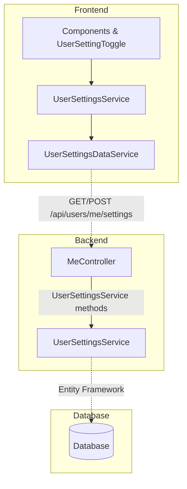

# {{ page.title }}

LightNap includes infrastructure for implementing a flexible user settings system that allows users to store and manage their personal preferences. This article demonstrates how to add a new user setting by walking through the process of implementing a boolean setting for optional cookie consent.

- TOC
{:toc}

## Understanding the User Settings System

The user settings system in LightNap provides a way to store key-value pairs associated with individual users. These settings are persisted in the database and are accessible across sessions. The system follows the standard LightNap architecture pattern:

- **Backend**: Settings are stored in the database and managed through a `UserSettingsService` in `LightNap.Core`
- **API Layer**: The `MeController` exposes endpoints under `/api/users/me/settings` for managing settings
- **Frontend**: The `ProfileService` manages user settings, and components like `UserSettingToggle` provide UI controls for more convenient access

Settings are stored as string key-value pairs, allowing flexibility in what can be stored. The frontend is responsible for converting values to/from appropriate types when reading and writing settings.

## Backend Implementation

### Understanding the Backend Services

The backend user settings functionality is built around the `IUserSettingsService` interface in `LightNap.Core/UserSettings/Interfaces`. Key methods include:

```csharp
public interface IUserSettingsService
{
    // Get a specific setting by key
    Task<string?> GetSettingAsync(string userId, string key);

    // Get all settings for a user
    Task<Dictionary<string, string>> GetAllSettingsAsync(string userId);

    // Set or update a setting
    Task SetSettingAsync(string userId, string key, string value);

    // Delete a setting
    Task DeleteSettingAsync(string userId, string key);
}
```

The service handles all database operations for user settings, and the `MeController` exposes these methods through REST endpoints that require the user to be authenticated.

### Step 1: Define Setting Key Constants

To maintain consistency and avoid typos, create constants for your setting keys. Add them to `LightNap.Core/Configuration/Constants.cs`:

```csharp
public static class UserSettingKeys
{
    public const string OptionalCookiesEnabled = "OptionalCookiesEnabled";
    public const string EmailNotifications = "EmailNotifications";
    public const string Theme = "Theme";
    // Add more setting keys as needed
}
```

  {: .note }
  The frontend file `app/core/backend-api/user-setting-key.ts` should be kept up to date with any changes to the backend's `UserSettingKeys` for easier reference in frontend code.

### Step 2: Define Supported Settings and Defaults

Since user settings can be any key-value pair, LightNap uses a registry to track which keys are valid to avoid database stuffing attacks. Add a new `UserSettingDefinition` record to `UserSettingsConfig._allSettings` at `LightNap.Core/Configuration/UserSettingsConfig.cs` to include new settings in the system:

```csharp
private static readonly UserSettingDefinition[] _allSettings =
    [
        new UserSettingDefinition(
            // The key from your constants
            Constants.UserSettingKeys.BrowserSettings,
            // The default value in JSON or an empty string for null
            "",
            // Who can read and edit this setting
            UserSettingAccessLevel.UserReadWrite,
            // True if the setting is active, false if archived
            true),
    ];
```

This approach provides several benefits:

- **Centralized Documentation**: All settings are documented in one place
- **Default Values**: Each setting has a clearly defined default value
- **API Documentation**: Can be exposed through an endpoint for frontend consumption

### Step 3: Reading User Settings

To read a user setting in your backend service, inject `IUserSettingsService` and call the appropriate method. Using the setting definitions approach ensures you always get the correct default value:

```csharp
public class MyService(
    IUserSettingsService userSettingsService,
    IUserContext userContext
) : IMyService
{
    public async Task<bool> GetOptionalCookiesEnabledAsync()
    {
        var userId = userContext.GetUserId();
        return await userSettingsService.GetUserSettingAsync<bool>(
            userId,
            Constants.UserSettingKeys.OptionalCookiesEnabled
        );
    }
}
```

### Step 4: Writing User Settings

Settings are typically updated by the user through the frontend, but you can also set them programmatically:

```csharp
public async Task SetOptionalCookiesEnabledAsync(bool enabled)
{
    var userId = userContext.GetUserId();
    await userSettingsService.SetUserSettingAsync(
        userId,
        new SetUserSettingRequestDto
        {
          Key = Constants.UserSettingKeys.OptionalCookiesEnabled,
          Value = enabled.ToString(),
        }
    );
}
```

### Step 5: Using Settings to Control Application Behavior

Here's a practical example of checking a user setting before performing an action:

```csharp
public async Task<ApiResponseDto<AnalyticsDto>> GetUserAnalyticsAsync()
{
    var userId = userContext.GetUserId();

    // Check if user has enabled optional cookies
    var optionalCookiesEnabled = await GetOptionalCookiesEnabledAsync();

    if (!optionalCookiesEnabled)
    {
        // Return minimal analytics or skip tracking
        return new ApiResponseDto<AnalyticsDto>
        {
            Result = new AnalyticsDto { Enabled = false }
        };
    }

    // Proceed with full analytics
    // ...
}
```

## Frontend Implementation

User settings on the frontend are accessed through the **`ProfileService`**, which is the main application service for user profile and settings data. The ProfileService is located in `app/core/services/profile.service.ts`.

### Step 1: Define Setting Keys

Keep the frontend setting keys file at ``app/core/backend-api/user-setting-key.ts` up to date.

```typescript
/*
 * Settings keys used in the application.
 */
export type UserSettingKey = "BrowserSettings" | "OptionalCookiesEnabled" | "ItemsPerPage";

export const UserSettingKeys = {
  BrowserSettings: "BrowserSettings",
  OptionalCookiesEnabled: "OptionalCookiesEnabled",
  ItemsPerPage: "ItemsPerPage",
} as const;

```

### Step 2: Understanding ProfileService for Settings

The `ProfileService` provides three key methods for working with user settings:

```typescript
// Get all settings as a dictionary
getSettings(): Observable<Array<UserSettingDto>>

// Get a specific setting with type safety
getSetting<T>(key: UserSettingKey, defaultValue?: T): Observable<T | null>

// Set a setting value
setSetting<T>(key: UserSettingKey, value: T): Observable<UserSettingDto>
```

The `ProfileService` automatically handles type conversion when retrieving values from the backend, but it's just basic JSON deserialization, so you will need to do additional work for objects like classes and Dates.

#### Example: Getting typed settings with defaults

```typescript
// Boolean setting
this.profileService.getSetting<boolean>(UserSettingKeys.OptionalCookiesEnabled, false)
  .subscribe(enabled => {
    this.optionalCookiesEnabled = enabled!;
  });

// Number setting
this.profileService.getSetting<number>(UserSettingKeys.ItemsPerPage, 10)
  .subscribe(itemsPerPage => {
    this.itemsPerPage = itemsPerPage!;
  });
```

### Step 3: Using the UserSettingToggleComponent

LightNap provides the `UserSettingToggleComponent`, a standalone component that allows the user to set or clear a boolean setting. The component is a smart control that integrates directly with the API, so all you need to do is give it a key and a label and the functionality and persistence is all handled internally.

```html
<div class="setting-section">
  <h3>Privacy Settings</h3>

  <div class="setting-item">
    <ln-user-setting-toggle
      key="OptionalCookiesEnabled"
      label="Enable Optional Cookies"
      />
  </div>
</div>
```

## Additional Resources

### Related Documentation

- [Solution & Project Structure](../concepts/project-structure) - Understanding the overall architecture
- [API Response Model](../concepts/api-response-model) - Understanding REST API patterns
- [Adding Profile Fields](./adding-profile-fields) - Working with user-specific data
- [Adding Entities](./adding-entities) - Creating database entities for custom settings

### Data Flow Pattern

User settings follow the standard LightNap data flow pattern:



## See Also

- [Adding Entities](./adding-entities) - Creating database entities
- [Adding Profile Fields](./adding-profile-fields) - User-specific data
- [Working With Roles](./working-with-roles) - User permissions
- [Solution & Project Structure](../concepts/project-structure) - Architecture overview
