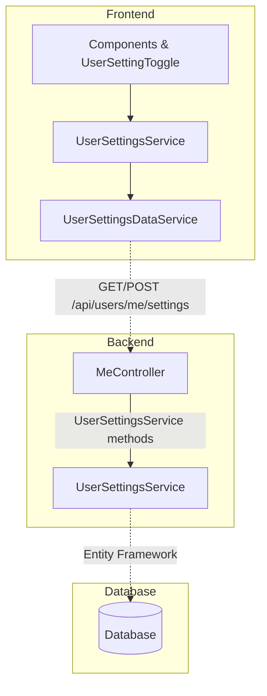

# {{ page.title }}

LightNap includes infrastructure for implementing a flexible user settings system that allows users to store and manage their personal preferences. This article demonstrates how to add a new user setting by walking through the `PreferredLanguage` setting—a comprehensive example that showcases integration with other services, automatic fallback logic, and reusable UI components.

- TOC
{:toc}

## Understanding the User Settings System

The user settings system in LightNap provides a way to store key-value pairs associated with individual users. These settings are persisted in the database and are accessible across sessions. The system follows the standard LightNap architecture pattern:

- **Backend**: Settings are stored in the database and managed through a `UserSettingsService` in `LightNap.Core`
- **API Layer**: The `MeController` exposes endpoints under `/api/users/me/settings` for managing settings
- **Frontend**: The `ProfileService` manages user settings, and components like `UserSettingToggle` provide UI controls for more convenient access

Settings are stored as string key-value pairs, allowing flexibility in what can be stored. The frontend is responsible for converting values to/from appropriate types when reading and writing settings.

## Backend Implementation

### Understanding the Backend Services

The backend user settings functionality is built around the `IUserSettingsService` interface in `LightNap.Core/UserSettings/Interfaces`. Key methods include:

```csharp
public interface IUserSettingsService
{
    // Get a specific setting by key
    Task<string?> GetSettingAsync(string userId, string key);

    // Get all settings for a user
    Task<Dictionary<string, string>> GetAllSettingsAsync(string userId);

    // Set or update a setting
    Task SetSettingAsync(string userId, string key, string value);

    // Delete a setting
    Task DeleteSettingAsync(string userId, string key);
}
```

The service handles all database operations for user settings, and the `MeController` exposes these methods through REST endpoints that require the user to be authenticated.

### Step 1: Define Setting Key Constants

To maintain consistency and avoid typos, create constants for your setting keys. Add them to `LightNap.Core/Configuration/Constants.cs`:

```csharp
public static class UserSettingKeys
{
    public const string BrowserSettings = "BrowserSettings";

    /// <summary>
    /// The user's preferred language code for content. Can be empty for auto-detection from browser.
    /// </summary>
    public const string PreferredLanguage = "PreferredLanguage";

    // Add more setting keys as needed
}
```

  {: .note }
  The frontend file `app/core/backend-api/user-setting-key.ts` should be kept up to date with any changes to the backend's `UserSettingKeys` for easier reference in frontend code.

### Step 2: Define Supported Settings and Defaults

Since user settings can be any key-value pair, LightNap uses a registry to track which keys are valid to avoid database stuffing attacks. Add a new `UserSettingDefinition` record to `UserSettingsConfig._allSettings` at `LightNap.Core/Configuration/UserSettingsConfig.cs` to include new settings in the system:

```csharp
private static readonly UserSettingDefinition[] _allSettings =
    [
        new UserSettingDefinition(
            Constants.UserSettingKeys.BrowserSettings,
            "",
            UserSettingAccessLevel.UserReadWrite,
            true),
        new UserSettingDefinition(
            // The key from your constants
            Constants.UserSettingKeys.PreferredLanguage,
            // The default value in JSON - empty string for auto-detect
            "\"\"",
            // Who can read and edit this setting
            UserSettingAccessLevel.UserReadWrite,
            // True if the setting is active, false if archived
            true),
    ];
```

This approach provides several benefits:

- **Centralized Documentation**: All settings are documented in one place
- **Default Values**: Each setting has a clearly defined default value
- **Security**: Only registered settings can be stored, preventing database stuffing attacks
- **API Documentation**: Can be exposed through an endpoint for frontend consumption

### Step 3: Reading User Settings

To read a user setting in your backend service, inject `IUserSettingsService` and call the `GetUserSettingAsync` method. This automatically handles access to the setting definitions to ensure you always get the correct JSON deserialization and default value:

```csharp
public class MyService(
    IUserSettingsService userSettingsService,
    IUserContext userContext
)
{
    public async Task<string> GetPreferredLanguageAsync()
    {
        var userId = userContext.GetUserId();
        var preferredLanguage = await userSettingsService.GetUserSettingAsync<string>(
            userId,
            Constants.UserSettingKeys.PreferredLanguage
        );

        // Empty string means auto-detect from browser
        return string.IsNullOrEmpty(preferredLanguage)
            ? GetBrowserLanguage()
            : preferredLanguage;
    }
}
```

### Step 4: Writing User Settings

Settings are typically updated by the user through the frontend, but you can also set them programmatically:

```csharp
public async Task SetPreferredLanguageAsync(string languageCode)
{
    var userId = userContext.GetUserId();
    await userSettingsService.SetUserSettingAsync(
        userId,
        new SetUserSettingRequestDto
        {
          Key = Constants.UserSettingKeys.PreferredLanguage,
          Value = languageCode,
        }
    );
}
```

### Step 5: Using Settings to Control Application Behavior

The `PreferredLanguage` setting demonstrates a sophisticated use case with automatic fallback logic. The `ContentService` in the frontend uses this setting to determine which language content to display:

```typescript
#getPreferredLanguageCode(): Observable<string> {
  return this.#identityService.watchLoggedIn$().pipe(
    take(1),
    switchMap(isLoggedIn => {
      if (!isLoggedIn) return of(this.#getBrowserLanguageCode());

      return this.#profileService.getSetting<string>(UserSettingKeys.PreferredLanguage, "").pipe(
        map(preferredLanguage => {
          // If user has set a preference, use it
          if (preferredLanguage?.length > 0) return preferredLanguage;
          // Otherwise fall back to browser language
          return this.#getBrowserLanguageCode();
        }),
        catchError(() => of(this.#getBrowserLanguageCode()))
      );
    })
  );
}
```

This pattern demonstrates:

- **Graceful Fallbacks**: Empty setting falls back to browser detection
- **Error Handling**: Service failures don't break the user experience
- **Authentication Awareness**: Different behavior for logged-in vs anonymous users

{: .note }
Accessing settings should only be done after the initial browser handshake has completed during the app load. This will ensure that the authentication token is available when requesting settings. Use `IdentityService.watchLoggedIn$().pipe(take(1))` in cases where you don't know if that initial token retrieval will have completed yet.

## Frontend Implementation

User settings on the frontend are accessed through the **`ProfileService`**, which is the main application service for user profile and settings data. The ProfileService is located in `app/core/services/profile.service.ts`.

### Step 1: Define Setting Keys

Keep the frontend setting keys file at `app/core/backend-api/user-setting-key.ts` up to date with your backend constants:

```typescript
/*
 * Settings keys used in the application.
 */
export type UserSettingKey = "BrowserSettings" | "PreferredLanguage";

export const UserSettingKeys = {
  BrowserSettings: "BrowserSettings",
  PreferredLanguage: "PreferredLanguage",
} as const;
```

### Step 2: Understanding ProfileService for Settings

The `ProfileService` provides three key methods for working with user settings:

```typescript
// Get all settings as a dictionary
getSettings(): Observable<Array<UserSettingDto>>

// Get a specific setting with type safety
getSetting<T>(key: UserSettingKey, defaultValue?: T): Observable<T | null>

// Set a setting value
setSetting<T>(key: UserSettingKey, value: T): Observable<UserSettingDto>
```

The `ProfileService` automatically handles type conversion when retrieving values from the backend, but it's just basic JSON deserialization, so you will need to do additional work for objects like classes and Dates.

#### Example: Getting typed settings with defaults

```typescript
// String setting with empty string default (for auto-detect)
this.profileService.getSetting<string>(UserSettingKeys.PreferredLanguage, "")
  .subscribe(language => {
    this.preferredLanguage = language || this.getBrowserLanguage();
  });

// The ProfileService handles JSON deserialization automatically
```

### Step 3: Using Reusable Setting Components

LightNap provides reusable components for common setting UI patterns. For the `PreferredLanguage` setting, we use `UserSettingSelectComponent`, which handles select dropdowns with automatic persistence:

#### Creating a Custom Setting Component

The `PreferredLanguageSelectComponent` demonstrates how to create a specialized component that wraps `UserSettingSelectComponent`:

```typescript
@Component({
  selector: "ln-preferred-language-select",
  standalone: true,
  templateUrl: "./preferred-language-select.component.html",
  imports: [CommonModule, UserSettingSelectComponent, ApiResponseComponent],
})
export class PreferredLanguageSelectComponent {
  readonly #contentService = inject(ContentService);

  readonly supportedLanguages = signal(
    this.#contentService
      .getSupportedLanguages()
      .pipe(map(languages => [
        new ListItem("", "Auto-detect"),
        ...languages.map(lang => new ListItem(lang.languageCode, lang.languageName))
      ]))
  );
}
```

#### Template Usage

```html
<ln-api-response [apiResponse]="supportedLanguages()">
  <ng-template #success let-supportedLanguages>
    <ln-user-setting-select
      key="PreferredLanguage"
      label="Preferred Language"
      [options]="supportedLanguages"
      [defaultValue]="null" />
  </ng-template>
</ln-api-response>
```

This pattern demonstrates:

- **Service Integration**: Fetching options from `ContentService`
- **Dynamic Options**: Building option lists with `ListItem`
- **Auto-detect Support**: Including an empty value for automatic detection
- **Reusability**: The component can be used anywhere in the application

  {: .note }
  For more details on creating reusable form components like this, see [Reusable Form Components](./reusable-form-components).

## Additional Resources

### Related Documentation

- [Solution & Project Structure](../concepts/project-structure) - Understanding the overall architecture
- [API Response Model](../concepts/api-response-model) - Understanding REST API patterns
- [Adding Profile Fields](./adding-profile-fields) - Working with user-specific data
- [Adding Entities](./adding-entities) - Creating database entities for custom settings

### Data Flow Pattern

User settings follow the standard LightNap data flow pattern:



## See Also

- [Reusable Form Components](./reusable-form-components) - Creating composable form components
- [Adding Entities](./adding-entities) - Creating database entities
- [Adding Profile Fields](./adding-profile-fields) - User-specific data
- [Working With Roles](./working-with-roles) - User permissions
- [Solution & Project Structure](../concepts/project-structure) - Architecture overview
