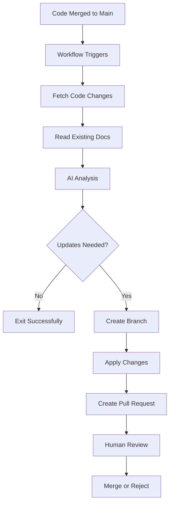

# {{ page.title }}

The LightNap repository includes an automated documentation agent that analyzes code changes and proposes documentation updates. This agent helps keep documentation synchronized with code changes by automatically detecting when features are added, patterns change, or new extensibility scenarios emerge.

- TOC
{:toc}

## Overview

The documentation agent is a GitHub Actions workflow that:

1. **Triggers automatically** after merges to the main branch that modify source code
2. **Analyzes changes** using AI to understand what was modified
3. **Evaluates impact** on existing documentation (concepts, getting started, common scenarios)
4. **Proposes updates** by creating a pull request with specific documentation changes
5. **Requires human review** before changes are merged

The agent is designed to be conservative and helpful - it won't create PRs for every code change, only when it detects changes that genuinely affect how developers use or extend LightNap.

## How It Works

### Architecture



### AI Analysis Process

The agent uses the configured AI model with a specialized prompt that understands:

- **LightNap's architecture**: ASP.NET Core backend, Angular frontend, the data flow patterns
- **Documentation structure**: The distinction between concepts, getting started guides, and common scenarios
- **Extensibility patterns**: How features like notifications and user settings demonstrate extensibility
- **What matters**: Not every code change requires documentation updates

The AI receives:

1. **Code diffs** from the most recent commit
2. **Full content** of changed files
3. **Current documentation** structure and content
4. **Context** about LightNap's architecture and documentation philosophy

It then proposes:

- Which documentation files need updates
- What specific changes to make
- Why each update is necessary

## Setup and Configuration

The automated documentation agent is **disabled by default** and requires explicit configuration to enable.

### Prerequisites

**Choose Your AI Provider**:

- **Option 1: OpenAI** (GPT-4) - More widely used, JSON mode support
- **Option 2: Anthropic** (Claude) - Often preferred for technical writing, competitive pricing

You'll also need:

- GitHub repository with appropriate permissions
- Repository variables for configuration

### Setup with OpenAI (Default)

#### Step 1: Create an OpenAI API Key

1. Visit [OpenAI Platform](https://platform.openai.com/)
2. Navigate to **API Keys** in your account settings
3. Create a new API key with a descriptive name like "LightNap Docs Agent"
4. Copy the key (you won't be able to see it again)

#### Step 2: Add the OpenAI API Key to GitHub Secrets

1. Go to your GitHub repository
2. Navigate to **Settings** > **Secrets and variables** > **Actions**
3. Click **New repository secret**
4. Name: `OPENAI_API_KEY`
5. Value: Paste your OpenAI API key
6. Click **Add secret**

#### Step 3: Enable the Workflow

1. In your repository, go to **Settings** > **Secrets and variables** > **Actions**
2. Click the **Variables** tab
3. Click **New repository variable**
4. Name: `RUN_DOCS_AGENT`
5. Value: `true`
6. Click **Add variable**

### Setup with Anthropic Claude

#### Step 1: Create an Anthropic API Key

1. Visit [Anthropic Console](https://console.anthropic.com/)
2. Navigate to **API Keys**
3. Create a new API key with a descriptive name like "LightNap Docs Agent"
4. Copy the key (you won't be able to see it again)

#### Step 2: Add the Anthropic API Key to GitHub Secrets

1. Go to your GitHub repository
2. Navigate to **Settings** > **Secrets and variables** > **Actions**
3. Click **New repository secret**
4. Name: `ANTHROPIC_API_KEY`
5. Value: Paste your Anthropic API key
6. Click **Add secret**

#### Step 3: Set AI Provider Variable

1. Still in **Settings** > **Secrets and variables** > **Actions**
2. Click the **Variables** tab
3. Click **New repository variable**
4. Name: `AI_PROVIDER`
5. Value: `anthropic`
6. Click **Add variable**

#### Step 4: Enable the Workflow

1. Click **New repository variable** (if not already done)
2. Name: `RUN_DOCS_AGENT`
3. Value: `true`
4. Click **Add variable**

### Verify Installation

The workflow files are already included in the repository:

- `.github/workflows/docs-agent.yaml` - GitHub Actions workflow definition
- `.github/scripts/docs-agent/` - Node.js script that performs the analysis

After enabling the workflow, it will trigger on the next merge to main that modifies files in `src/` or `Scaffolding/`.

## Configuration Options

### Environment Variables

The agent can be configured through environment variables in the workflow file (`.github/workflows/docs-agent.yaml`):

| Variable | Description | Default |
|----------|-------------|---------|
| `BASE_BRANCH` | The branch to create PRs against | `main` |
| `AI_PROVIDER` | AI provider to use: `openai` or `anthropic` | `openai` |
| `OPENAI_API_KEY` | Your OpenAI API key (if using OpenAI) | *(required for OpenAI)* |
| `ANTHROPIC_API_KEY` | Your Anthropic API key (if using Anthropic) | *(required for Anthropic)* |
| `GITHUB_TOKEN` | GitHub authentication | *(automatic)* |

### Customizing the AI Prompt

The AI's behavior can be customized by editing the system prompt in `.github/scripts/docs-agent/index.js`:

```javascript
const systemPrompt = `You are an expert technical documentation analyst...`;
```

Consider customizing this if you:

- Add new documentation sections
- Want to emphasize different aspects
- Have specific style guidelines
- Want to adjust the threshold for when updates are proposed

### Switching Between AI Providers

To switch from OpenAI to Anthropic (or vice versa):

1. **Add the new API key** as a GitHub Secret (if not already added)
2. **Update `AI_PROVIDER` variable**:
   - Go to **Settings** > **Secrets and variables** > **Actions** > **Variables**
   - Edit `AI_PROVIDER` to either `openai` or `anthropic`
3. **Test** by manually triggering the workflow

The agent will automatically use the specified provider on the next run.

**Why switch?**

- **Anthropic Claude**: Often excels at technical writing and documentation tasks, competitive pricing
- **OpenAI GPT-4**: More widely adopted, strong JSON formatting, familiar to most developers

Both providers work equally well for this use case.

### Adjusting Trigger Conditions

Edit `.github/workflows/docs-agent.yaml` to change when the agent runs:

```yaml
on:
  push:
    branches:
      - main
    paths:
      - 'src/**'           # Trigger on source code changes
      - 'Scaffolding/**'   # Trigger on scaffolding changes
```

## Using the Agent

### Automatic Operation

Once enabled, the agent operates automatically:

1. **Developer merges PR** to main with code changes
2. **Workflow triggers** and analyzes the changes
3. **If updates needed**, a PR is created with title "📚 Automated documentation update"
4. **Review the PR** - check the proposed changes
5. **Edit if needed** - you can make changes directly in the PR
6. **Merge or close** the PR based on your review

### Manual Trigger

You can manually trigger the agent:

1. Go to **Actions** tab in your repository
2. Select **Automated Documentation Agent** workflow
3. Click **Run workflow**
4. Select the branch (usually `main`)
5. Click **Run workflow**

This is useful for:

- Testing the agent after setup
- Analyzing accumulated changes
- Re-running after adjusting the prompt

## Reviewing Agent PRs

When the agent creates a pull request, review it carefully:

### What to Check

1. **Accuracy**: Do the proposed changes correctly reflect the code changes?
2. **Completeness**: Are all necessary updates included?
3. **Style**: Does the writing match the existing documentation style?
4. **Examples**: Are code examples correct and complete?
5. **Links**: Do internal links work correctly?

### Making Adjustments

You can edit the documentation directly in the PR:

1. Click on a file in the PR
2. Click the **Edit** button (pencil icon)
3. Make your changes
4. Commit directly to the PR branch

### Common Scenarios

**Agent missed something important**:

- Add the missing documentation directly to the PR
- Consider adjusting the AI prompt to catch similar cases in the future

**Agent proposed unnecessary changes**:

- Remove those changes from the PR, or close the PR entirely
- Adjust the prompt to be more conservative if this happens frequently

**Changes need significant rework**:

- Close the automated PR
- Create a new branch manually
- Write the documentation yourself with the agent's PR as a reference

## Best Practices

### For Code Changes

When making code changes that affect extensibility patterns:

1. **Follow existing patterns** - The agent recognizes patterns like notifications and user settings
2. **Use clear names** - Well-named classes and methods help the agent understand intent
3. **Add code comments** - The agent can read comments to understand purpose
4. **Document major changes** - For breaking changes, consider updating docs manually alongside code

### For Documentation

Structure your documentation to help the agent:

1. **Consistent sections** - Use similar structure across similar docs (like development-guide articles)
2. **Clear titles** - Descriptive titles help the agent identify which docs to update
3. **Code examples** - Include examples showing the patterns you want to document
4. **Metadata** - Use frontmatter consistently (title, parent, nav_order)

### For Agent Maintenance

1. **Monitor PR quality** - Review several automated PRs to assess accuracy
2. **Adjust prompts** - Fine-tune the AI prompt based on actual performance
3. **Check costs** - Monitor OpenAI API usage and costs
4. **Update dependencies** - Keep Node.js packages up to date

## Troubleshooting

### Workflow Not Triggering

**Check if enabled**:

- Verify `RUN_DOCS_AGENT` variable is set to `true`
- Check that your changes are in the monitored paths (`src/` or `Scaffolding/`)

**Check workflow permissions**:

- Ensure GitHub Actions has write permissions for contents and pull requests
- Go to **Settings** > **Actions** > **General** > **Workflow permissions**

### Agent Fails to Run

**Check secrets**:

```bash
# The workflow should fail with a clear error if OPENAI_API_KEY is missing
```

**Check API limits**:

- Verify your OpenAI account has available credits
- Check for rate limits or quota issues

**Check logs**:

- Go to **Actions** tab
- Click on the failed workflow run
- Review the logs for error messages

### Poor Quality Suggestions

**Prompt needs adjustment**:

- Edit `.github/scripts/docs-agent/index.js`
- Modify the `systemPrompt` to be more specific about your needs
- Add examples of good vs. bad documentation updates

**Context is insufficient**:

- The agent might need more context about the changes
- Consider increasing the content limits in the script
- Add more documentation structure information

### API Costs Too High

**Reduce frequency**:

- Change the workflow to trigger only on certain paths
- Add a manual approval step before running
- Schedule runs instead of triggering on every merge

**Use a cheaper model or provider**:

- **OpenAI**: Change `gpt-4o` to `gpt-4o-mini` in the script
- **Anthropic**: Use `claude-3-5-haiku` instead of `claude-3-5-sonnet`
- **Switch providers**: Compare costs between OpenAI and Anthropic
- Test the quality difference with your specific use case

**Batch changes**:

- Run less frequently
- Let changes accumulate before analyzing

## Security Considerations

### API Key Protection

- **Never commit** the API key to the repository
- Store it in **GitHub Secrets** only
- Rotate keys periodically
- Monitor usage for unexpected spikes

### Repository Permissions

The workflow requires:

- `contents: write` - To create branches and commit files
- `pull-requests: write` - To create pull requests

These permissions are scoped to the workflow and don't grant broader access.

### Review Process

Always review automated PRs before merging:

- The agent could misunderstand changes
- AI-generated content should always be verified
- Malicious code changes could trick the agent

## Cost Estimation

Typical costs per run (as of November 2024):

**OpenAI**:

- **GPT-4o**: ~$0.01-0.10 per analysis
- **GPT-4o-mini**: ~$0.001-0.01 per analysis (much cheaper)
- **Monthly estimate**: $3-30 for moderately active repository

**Anthropic**:

- **Claude 3.5 Sonnet**: ~$0.01-0.12 per analysis
- **Claude 3.5 Haiku**: ~$0.001-0.02 per analysis (faster, cheaper)
- **Monthly estimate**: $3-35 for moderately active repository

**GitHub Actions**: Free for public repositories, included in private repo minutes

Factors affecting cost:

- Number of files changed
- Size of documentation
- Frequency of runs
- Model choice and provider

## Limitations

### What the Agent Can Do

- ✅ Detect when new extensibility patterns are added
- ✅ Identify changes to existing patterns
- ✅ Propose specific documentation updates
- ✅ Create well-formatted markdown content
- ✅ Understand LightNap's architecture

### What the Agent Cannot Do

- ❌ Understand business domain context outside of code
- ❌ Make subjective decisions about what's "important"
- ❌ Test documentation examples for correctness
- ❌ Replace human technical writing expertise
- ❌ Guarantee perfect accuracy

### When to Document Manually

Consider manual documentation for:

- Major feature additions
- Breaking changes
- Complex architectural decisions
- Business domain concepts
- Migration guides
- Troubleshooting guides

## Advanced Customization

### Custom Analysis Logic

You can extend the agent's analysis by modifying `index.js`:

```javascript
// Add custom logic to filter or prioritize changes
function shouldAnalyzeFile(filename) {
  // Custom logic here
  return filename.includes('Services') || filename.includes('Controllers');
}
```

### Integration with Other Tools

The agent can be integrated with:

- **Slack/Discord**: Send notifications when PRs are created
- **Linear/Jira**: Create issues for documentation tasks
- **Vale/MarkdownLint**: Validate generated documentation

### Changing AI Models

The agent supports multiple AI providers out of the box:

**OpenAI Models** (set `AI_PROVIDER=openai`):

- `gpt-4o` (default) - Best quality, higher cost
- `gpt-4o-mini` - Good quality, lower cost
- Edit model in `index.js`: `model: 'gpt-4o-mini'`

**Anthropic Models** (set `AI_PROVIDER=anthropic`):

- `claude-3-5-sonnet-20241022` (default) - Excellent for technical writing
- `claude-3-5-haiku-20241022` - Faster and cheaper
- Edit model in `index.js`: `model: 'claude-3-5-haiku-20241022'`

**Other Providers**:

The script can be further adapted for:

- **Azure OpenAI**: For enterprise Azure deployments
- **Local models**: For privacy/cost considerations (requires custom implementation)

## Support and Feedback

### Getting Help

If you encounter issues:

1. Check the GitHub Actions logs in your repository
2. Review the troubleshooting section above
3. Open an issue with the `documentation` and `automated` labels

### Improving the Agent

Contributions are welcome:

- Suggest prompt improvements
- Report accuracy issues
- Share configuration tips
- Propose new features

## Related Documentation

- [GitHub Actions Workflows Overview](./index)
- [Build, Test, and Publish Workflow](./build-test-publish)
- [GitHub Pages Deployment](./github-pages)
- [Development Guide](../development-guide/index) - Examples of what the agent documents

## See Also

- [GitHub Actions Documentation](https://docs.github.com/en/actions)
- [OpenAI API Reference](https://platform.openai.com/docs/api-reference)
- [Just the Docs Theme](https://just-the-docs.github.io/just-the-docs/)
