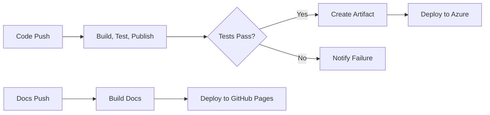

# {{ page.title }}

LightNap includes pre-configured GitHub Actions workflows for continuous integration, deployment, and documentation publishing. These workflows are disabled by default and can be activated by setting specific repository variables.

## CI/CD Workflows

### [Build, Test, and Publish](./build-test-publish)

The foundation CI workflow that builds both the .NET backend and Angular frontend, runs all tests, and packages the application as an artifact for deployment. This workflow triggers on commits to the `main` branch that modify the `src` folder.

**Activation**: Set repository variable `RUN_BUILD_TEST_PUBLISH` to `true`.

### [Deploy to Azure App Service](./deploy-to-azure)

Automatically deploy LightNap to Azure App Service after a successful build. This workflow takes the artifact from the Build, Test, and Publish workflow and deploys it to your Azure environment.

**Activation**:

1. Set repository variable `RUN_DEPLOY_TO_AZURE_APP_SERVICE` to `true`
2. Set repository secret `AZURE_APP_SERVICE_NAME` with your app service name
3. Set repository secret `AZURE_WEBAPP_PUBLISH_PROFILE` with your publish profile

## Documentation Workflows

### [Deploy to GitHub Pages](./github-pages)

Automatically build and deploy this Jekyll-based documentation site to GitHub Pages whenever changes are committed to the `docs` folder on the `main` branch.

**Activation**:

1. Enable GitHub Pages for your repository using "GitHub Actions" as the source
2. Set repository variable `RUN_BUILD_AND_DEPLOY_DOCS` to `true`

### [Automated Documentation Agent](./automated-docs-agent)

An AI-powered agent that analyzes code changes and proposes documentation updates. After merges to main that modify source code, the agent evaluates what documentation needs to be added, updated, or removed and creates a pull request with the proposed changes.

**Activation**:

1. Create an API key and add it as repository secret
   - `OPENAI_API_KEY` for OpenAI
   - `ANTHROPIC_API_KEY` for Anthropic
2. Set repository variable `RUN_DOCS_AGENT` to `true`

## Workflow Architecture

The workflows follow a staged approach:

## Getting Started with Workflows

1. **Start with Build, Test, Publish** - Ensures your code builds and tests pass on every commit
2. **Add Azure Deployment** - Automate deployments after builds succeed
3. **Enable Documentation** - Keep your docs up-to-date automatically

## Best Practices

- **Test Locally First** - Ensure builds and tests work locally before enabling CI/CD
- **Secure Your Secrets** - Always use GitHub secrets for sensitive data like connection strings and publish profiles
- **Review Workflow Logs** - Check the Actions tab in GitHub for detailed execution logs
- **Customize As Needed** - These workflows are templates; modify them to fit your deployment needs
